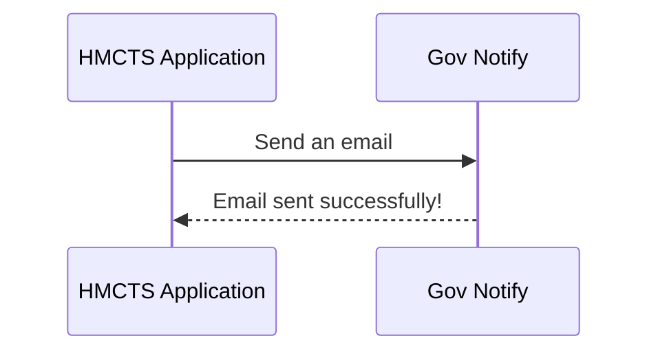

# Backstage HMCTS Examples

This project is intended to be used to produce examples of features that can be used for some of the plugins within the HMCTS instance of Backstage.

To see the examples in use please visit the [Backstage HMCTS Sandbox instance](https://backstage-sandbox.hmcts.net/)

# Features

The following Backstage features can be experimented within this project:

## Backstage Software Catalog

To make use of the Backstage Software Catalog for your project, ensure your project is registered as a component by creating (or updating) the `catalog-info.yaml` file in the route of your project:

```yaml
apiVersion: backstage.io/v1alpha1
kind: Component
metadata:
  name: "my-project-name-component"
  description: This is a test example of a Backstage component for HMCTS
  annotations:
    # This must match folder-name/job-name in Jenkins.
    jenkins.io/job-full-name: cft:HMCTS_j_to_z/my-project-pipeline
    github.com/project-slug: 'hmcts/my-project-name'
  tags:
    - java
  links:
    - url: https://hmcts-reform.slack.com/app_redirect?channel=cloud-native
      title: cloud-native on Slack
      icon: chat
spec:
  type: service
  system: my-project
  lifecycle: experimental
  owner: dts_cft_developers
```

## API's

To make use of the Backstage API's feature for your project, ensure you register the API by updating `catalog-info.yaml` file in the route of your project for each Open API spec you want to register:

Add this to the Component part of the `catalog-info.yaml` file from above:
```yaml
spec:
  --- existing config ---
  providesApis:
  - my-project-api
```
And then add the following to the end of the `catalog-info.yaml` file:
```yaml
---
apiVersion: backstage.io/v1alpha1
kind: API
metadata:
  name: my-project-api
  description: This is an API for my project
  annotations:
    github.com/project-slug: 'hmcts/my-project-name'
spec:
  type: openapi
  lifecycle: experimental
  owner: dts_cft_developers
  system: my-project
  apiProvidedBy: my-project-name-component
  definition:
    $text: https://raw.githubusercontent.com/hmcts/backstage-hmcts-examples/master/src/main/resources/openapi/testspec.yaml
```

If you have multiple API's to register, simply add another section starting with `---` and change the `metadata.name` and `spec.definition.$text` values accordingly.

### API Linter

To ensure HMCTS API's conform to the agreed linting rules, the Spectral plugin has been added to HMCTS Backstage. To use, simply go to your API in Backstage and navigate to the Linter tab. If your API does not conform to the rules, you will see a list of issues that need to be resolved.


## Tech Docs
To make use of the Backstage Tech Docs feature for your project, ensure the catalog-info.yaml for your project file contains the following annotation:

```yaml
metadata:
  annotations:
    --- exisitng config ---
    backstage.io/techdocs-ref: dir:.
    ---
```

and then in the root of your project create a directory called `docs` and add your markdown files there. Create an mkdocs.yaml in the root of your repository and add the following:

```yaml
site_name: 'Backstage HMCTS Examples'

nav:
  - Index page: index.md
  - Another section:
      - Another subpage: techdocs/example-tech-doc.md
plugins:
  - techdocs-core
```

Once merged, your docs should appear in Backstage when it next syncs the catalog.


### Mermaid Diagrams in Tech Docs

To make use of Mermaid diagrams in your Tech Docs markdown files, you will need to add the `markdown_inline_mermaid` extension to your mkdocs.yaml file as follows:

```yaml
markdown_extensions:
  - markdown_inline_mermaid
```

you can then add Mermaid diagrams to your markdown files using the following syntax:

````yaml

````

This will render the diagram like this in the Tech Docs section of Backstage:


## Architectural Decision Records (ADRs)

An ADR is a document that captures an important architectural decision made along with its context and consequences. This project contains an example of how to create and manage ADR's within Backstage.

To display ADR's in HMCTS Backstage, ensure the catalog-info.yaml for your project file contains the following annotation:

```yaml
metadata:
  annotations:
    --- exisitng config ---
    backstage.io/adr-location: docs/adrs
   ---
```
and then in the root of your project create a directory called `docs/adrs` and add your ADR markdown files there. Once merged, your ADR should appear in Backstage when it next syncs the catalog.

For an example of how to structure a HMCTS ADR, please see this [template](https://tools.hmcts.net/confluence/display/DATS/ADR+Template).


Further details about the ADR Backstage plugin can be found [here](https://github.com/backstage/community-plugins/tree/main/workspaces/adr/plugins/adr).

### Creating an ADR using the template from within Backstage

An ADR template has been added to the HMCTS instance of Backstage to help teams create ADR's in a consistent manner. To use, go to Create > Create an Architectural Decision Record (ADR) > Choose and then fill in the details to populate the template.

This will automatically create a Pull Request in your repository with the new ADR file in the `docs/adrs` directory. Once merged, it will show automatically in Backstage.

## Notes

JUnit 5 is enabled by default in the project. Please refrain from using JUnit4 and use the next generation

## Building and deploying the application

### Building the application

The project uses [Gradle](https://gradle.org) as a build tool. It already contains
`./gradlew` wrapper script, so there's no need to install gradle.

To build the project execute the following command:

```bash
  ./gradlew build
```

### Running the application

Create the image of the application by executing the following command:

```bash
  ./gradlew assemble
```

Create docker image:

```bash
  docker-compose build
```

Run the distribution (created in `build/install/spring-boot-template` directory)
by executing the following command:

```bash
  docker-compose up
```

This will start the API container exposing the application's port
(set to `4550` in this template app).

In order to test if the application is up, you can call its health endpoint:

```bash
  curl http://localhost:4550/health
```

You should get a response similar to this:

```
  {"status":"UP","diskSpace":{"status":"UP","total":249644974080,"free":137188298752,"threshold":10485760}}
```

### Alternative script to run application

To skip all the setting up and building, just execute the following command:

```bash
./bin/run-in-docker.sh
```

For more information:

```bash
./bin/run-in-docker.sh -h
```

Script includes bare minimum environment variables necessary to start api instance. Whenever any variable is changed or any other script regarding docker image/container build, the suggested way to ensure all is cleaned up properly is by this command:

```bash
docker-compose rm
```

It clears stopped containers correctly. Might consider removing clutter of images too, especially the ones fiddled with:

```bash
docker images

docker image rm <image-id>
```

There is no need to remove postgres and java or similar core images.

## License
This project is licensed under the MIT License - see the [LICENSE](LICENSE) file for details

