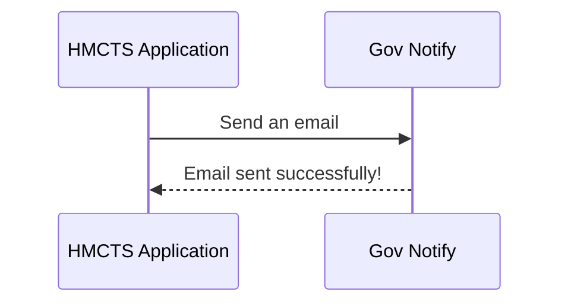

# Mermaid Diagram Example

## Context

This is an example of a Mermaid diagram that can be included in documentation to illustrate a sequence of interactions between components in a system.

```mermaid
sequenceDiagram
HMCTS Application->>Gov Notify: Send an email
Gov Notify-->>HMCTS Application: Email sent successfully!
```
